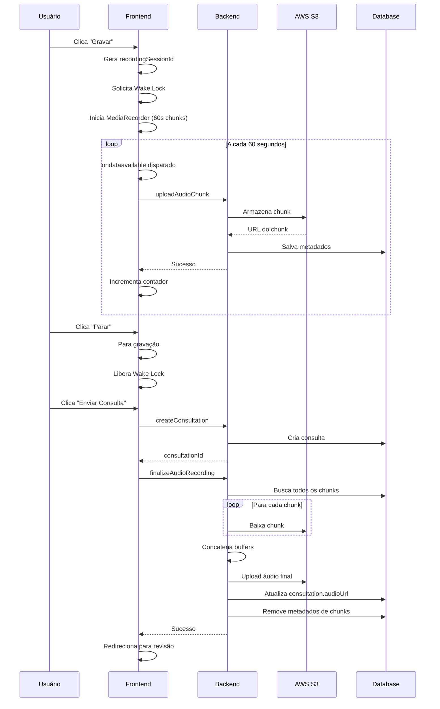

# Gravação de Áudio Progressiva com Upload em Chunks

## 📋 Visão Geral

Este documento descreve a implementação da **gravação de áudio resiliente com upload progressivo em chunks**, projetada para prevenir perda de dados durante gravações longas em dispositivos móveis quando a tela bloqueia ou o navegador suspende.

## 🎯 Problema Resolvido

**Problema Original:**
- Gravações de áudio longas (consultas odontológicas) eram interrompidas quando:
  - A tela do dispositivo móvel bloqueava
  - O navegador suspendia a aba por inatividade
  - O aplicativo perdia foco por muito tempo
- Resultado: **Perda total da gravação** e necessidade de recomeçar

**Solução Implementada:**
- Upload progressivo de chunks de áudio a cada 60 segundos
- Armazenamento imediato de cada chunk no backend (S3 + Database)
- Wake Lock API para tentar manter a tela ativa (quando suportado)
- Concatenação automática dos chunks ao finalizar
- Preservação de gravações parciais em caso de interrupção

## 🏗️ Arquitetura

### Backend

#### 1. Schema do Banco de Dados (`drizzle/schema.ts`)

Nova tabela `audioChunks`:

```typescript
export const audioChunks = mysqlTable("audioChunks", {
  id: int("id").autoincrement().primaryKey(),
  consultationId: int("consultationId").notNull(),
  recordingSessionId: varchar("recordingSessionId", { length: 64 }).notNull(),
  chunkIndex: int("chunkIndex").notNull(),
  fileKey: text("fileKey").notNull(),
  url: text("url").notNull(),
  mimeType: varchar("mimeType", { length: 50 }).notNull(),
  sizeBytes: int("sizeBytes").notNull(),
  durationSeconds: int("durationSeconds"),
  uploadedAt: timestamp("uploadedAt").defaultNow().notNull(),
});
```

**Campos Importantes:**
- `recordingSessionId`: Identificador único da sessão de gravação (formato: `session-{timestamp}-{random}`)
- `chunkIndex`: Índice sequencial do chunk (0, 1, 2, ...) para ordenação correta
- `fileKey`: Chave do arquivo no S3
- `url`: URL pública do chunk armazenado

#### 2. Funções de Database (`server/db.ts`)

```typescript
// Criar novo chunk
createAudioChunk(data: InsertAudioChunk): Promise<void>

// Buscar todos os chunks de uma sessão (ordenados por índice)
getAudioChunksBySession(consultationId: number, recordingSessionId: string): Promise<AudioChunk[]>

// Deletar chunks após concatenação
deleteAudioChunks(consultationId: number, recordingSessionId: string): Promise<void>
```

#### 3. Rotas tRPC (`server/routers.ts`)

##### `uploadAudioChunk`

Upload de chunk individual durante gravação:

```typescript
input: {
  consultationId: number,
  recordingSessionId: string,
  chunkIndex: number,
  audioBase64: string,
  mimeType: string,
  durationSeconds?: number
}
```

**Fluxo:**
1. Valida acesso à consulta
2. Converte base64 para Buffer
3. Armazena chunk no S3: `consultations/{userId}/{consultationId}/chunks/{sessionId}/chunk-{index}.webm`
4. Salva metadados no banco de dados
5. Retorna confirmação

##### `finalizeAudioRecording`

Concatenação e finalização da gravação:

```typescript
input: {
  consultationId: number,
  recordingSessionId: string,
  totalDurationSeconds?: number
}
```

**Fluxo:**
1. Busca todos os chunks da sessão (ordenados)
2. Baixa cada chunk do S3
3. Concatena todos os buffers em um único arquivo
4. Upload do arquivo final para S3: `consultations/{userId}/{consultationId}/audio-final-{nanoid}.webm`
5. Atualiza tabela `consultations` com URL do áudio final
6. Remove metadados de chunks do banco (mantém arquivos no S3 para segurança)

### Frontend

#### 1. Estado e Refs (`client/src/pages/NewConsultation.tsx`)

**Novos Estados:**
```typescript
const [uploadingChunk, setUploadingChunk] = useState(false);
const [chunksUploaded, setChunksUploaded] = useState(0);
```

**Novas Refs:**
```typescript
const recordingSessionIdRef = useRef<string | null>(null);
const chunkIndexRef = useRef<number>(0);
const wakeLockRef = useRef<any>(null);
const currentConsultationIdRef = useRef<number | null>(null);
```

#### 2. Gravação Progressiva

**Inicialização da Gravação:**

```typescript
startRecording():
  1. Gera recordingSessionId único
  2. Solicita Wake Lock (se disponível)
  3. Configura MediaRecorder com timeslice de 60000ms (60 segundos)
  4. Define handler ondataavailable para upload automático de chunks
  5. Inicia gravação
```

**Upload Automático de Chunks:**

```typescript
mediaRecorder.ondataavailable = async (e) => {
  - Converte Blob para base64
  - Envia via uploadAudioChunkMutation
  - Incrementa chunkIndex
  - Atualiza contador de chunks enviados
  - Continua gravação mesmo se upload falhar
}
```

**Finalização:**

```typescript
handleSubmit():
  - Detecta se usou gravação progressiva (chunksUploaded > 0)
  - Se sim: chama finalizeAudioRecording
  - Se não: usa método legado (upload único)
```

#### 3. Wake Lock API

Implementação opcional para tentar prevenir suspensão:

```typescript
const requestWakeLock = async () => {
  if ('wakeLock' in navigator) {
    wakeLockRef.current = await navigator.wakeLock.request('screen');
  }
}
```

**Notas:**
- Suportado apenas em navegadores modernos
- Não funciona em segundo plano
- Requer HTTPS
- Liberado automaticamente ao parar gravação

#### 4. UI/UX

**Feedback Visual Durante Gravação:**

```
┌─────────────────────────────────────┐
│         [Microfone Pulsando]        │
│            00:02:45                 │
│   ● 2 chunk(s) enviado(s)          │
│   💡 Mantenha a tela ativa          │
│   [Pausar]    [Parar]               │
└─────────────────────────────────────┘
```

**Indicadores:**
- 🟢 Verde: Chunk enviado com sucesso
- 🟡 Amarelo (pulsando): Enviando chunk
- Contador de chunks enviados
- Mensagem orientando manter tela ativa

## 📊 Fluxo Completo



## 🔒 Segurança e Confiabilidade

### Prevenção de Perda de Dados

1. **Upload Imediato**: Chunks são enviados assim que disponíveis (60s)
2. **Persistência Redundante**: Chunks ficam no S3 mesmo após concatenação
3. **Continuação em Falha**: Se um chunk falhar, gravação continua
4. **Metadata Tracking**: Banco rastreia todos os chunks enviados

### Validação de Acesso

- Todas as rotas são `protectedProcedure` (autenticação obrigatória)
- Validação de propriedade: `consultation.dentistId === ctx.user.id`
- Sessões isoladas por `recordingSessionId`

### Fallback para Método Legado

```typescript
if (chunksUploaded > 0) {
  // Usar método progressivo
} else {
  // Usar upload único (arquivos importados, gravações curtas)
}
```

## 🎛️ Configurações

### Tamanho do Chunk

**Atual:** 60 segundos (60000ms)

**Ajustar em:**
- `client/src/pages/NewConsultation.tsx` → `mediaRecorder.start(60000)`
- `client/src/pages/NewConsultation.tsx` → `durationSeconds: 60` no uploadAudioChunk

**Considerações:**
- Chunks menores (30s): Mais resiliente, mais uploads, mais overhead
- Chunks maiores (120s): Menos uploads, maior risco em suspensão curta
- Recomendado: **60-90 segundos** para equilíbrio

### Limite de Tamanho

**Backend não impõe limite por chunk**, mas cada chunk individual deve caber na memória.

**Arquivo final:** Concatenação pode gerar arquivos grandes. Considerar:
- Streaming de concatenação (para arquivos > 100MB)
- Compressão adicional
- Transcrição por chunks (sem concatenar)

## 🚀 Melhorias Futuras

### Curto Prazo

- [ ] Retry automático de chunks com falha
- [ ] Indicador de largura de banda/qualidade de conexão
- [ ] Compressão adicional de chunks antes do upload
- [ ] Validação de integridade (checksums)

### Médio Prazo

- [ ] Background Sync API (upload mesmo offline)
- [ ] IndexedDB local cache para chunks não enviados
- [ ] Transcrição progressiva (chunk por chunk)
- [ ] Resumable uploads (retomar uploads interrompidos)

### Longo Prazo

- [ ] WebRTC para streaming em tempo real
- [ ] Processamento de áudio no servidor durante upload
- [ ] Análise de qualidade de áudio em tempo real
- [ ] Detecção automática de silêncios para otimizar chunks

## 📱 Compatibilidade

### Navegadores Suportados

| Recurso                | Chrome/Edge | Safari iOS | Firefox | Samsung Internet |
|------------------------|-------------|------------|---------|------------------|
| MediaRecorder          | ✅          | ✅ (14.5+) | ✅      | ✅               |
| timeslice parameter    | ✅          | ✅         | ✅      | ✅               |
| Wake Lock API          | ✅          | ❌         | ❌      | ✅               |
| Background operation   | ⚠️ Limitado | ❌         | ❌      | ⚠️ Limitado      |

**Legenda:**
- ✅ Totalmente suportado
- ⚠️ Suporte parcial
- ❌ Não suportado

### Recomendações aos Usuários

1. **Use navegadores modernos**: Chrome, Edge, Safari 14.5+
2. **Mantenha a tela ativa**: Não minimize o app durante gravação
3. **Conexão estável**: Wi-Fi ou 4G/5G para uploads
4. **Carregador conectado**: Para gravações longas (> 30min)
5. **Permissões ativas**: Microfone e (idealmente) notificações

## 🧪 Testando

### Teste Local

1. Iniciar gravação de consulta
2. Observar indicador de chunks enviados
3. Aguardar pelo menos 2-3 minutos
4. Verificar logs do console para uploads
5. Parar e enviar consulta
6. Verificar áudio final reproduzível

### Teste de Suspensão (Mobile)

1. Iniciar gravação
2. Aguardar 1 chunk ser enviado
3. Bloquear tela por 30 segundos
4. Desbloquear e verificar se continua
5. Finalizar e enviar

### Teste de Concatenação

1. Gravar por 3+ minutos (3+ chunks)
2. Verificar no S3: múltiplos arquivos chunk-0, chunk-1, chunk-2
3. Enviar consulta
4. Verificar no S3: arquivo final `audio-final-*.webm`
5. Reproduzir áudio para validar integridade

## 📞 Troubleshooting

### Chunks não estão sendo enviados

**Sintomas:** Contador permanece em 0

**Causas possíveis:**
1. `currentConsultationIdRef.current` é null
   - **Solução:** Criar consulta antes de iniciar gravação (ajustar fluxo)
2. MediaRecorder não dispara ondataavailable
   - **Solução:** Verificar suporte do navegador a timeslice
3. Upload mutation falhando
   - **Solução:** Verificar logs do console, conectividade

### Áudio final corrompido

**Sintomas:** Arquivo reproduz mas com cortes/silêncios

**Causas possíveis:**
1. Chunks fora de ordem
   - **Solução:** Garantir `orderBy(audioChunks.chunkIndex)` no DB
2. Chunks com codecs diferentes
   - **Solução:** Forçar mimeType consistente
3. Concatenação binária incompatível
   - **Solução:** Usar ferramenta de remux (ffmpeg) no backend

### Wake Lock não funciona

**Sintomas:** Tela continua desligando

**Causas possíveis:**
1. Navegador não suporta
   - **Solução:** Orientar usuário a manter tela ativa manualmente
2. HTTPS não configurado
   - **Solução:** Garantir certificado SSL válido
3. Permissões negadas
   - **Solução:** Solicitar permissão explicitamente

---

## 🎓 Referências Técnicas

- [MDN: MediaRecorder API](https://developer.mozilla.org/en-US/docs/Web/API/MediaRecorder)
- [MDN: Screen Wake Lock API](https://developer.mozilla.org/en-US/docs/Web/API/Screen_Wake_Lock_API)
- [Web Audio API Guide](https://developer.mozilla.org/en-US/docs/Web/API/Web_Audio_API)
- [jsPDF Documentation](https://github.com/parallax/jsPDF)

---

**Implementado em:** Janeiro 2026  
**Versão:** 1.0.0  
**Autor:** ZEAL Development Team

